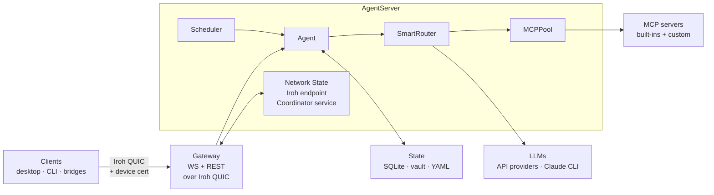
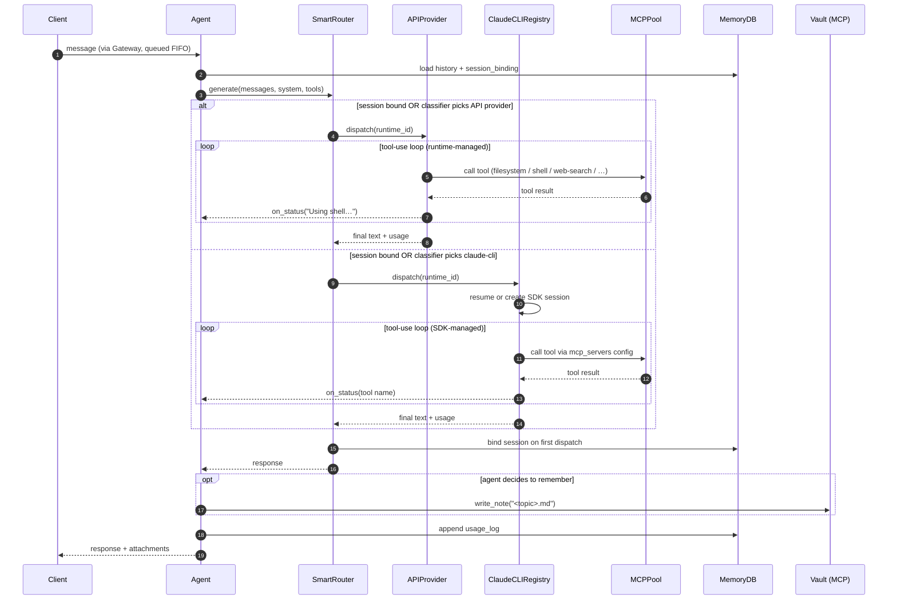
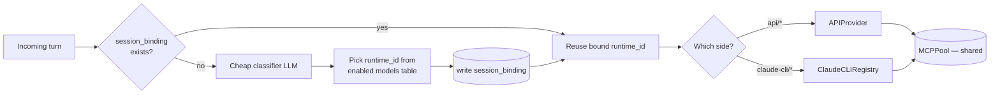
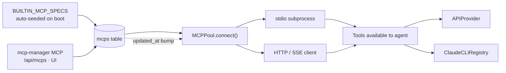
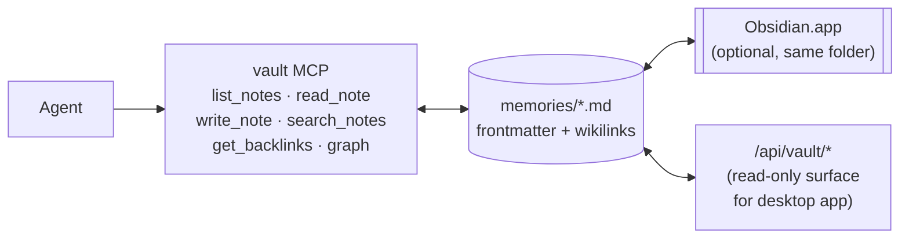
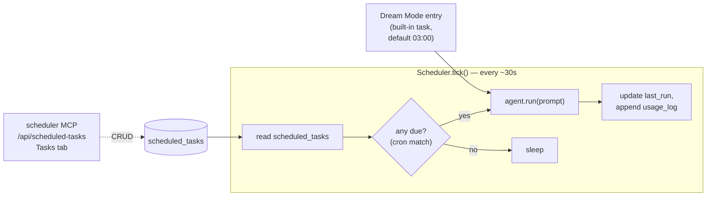
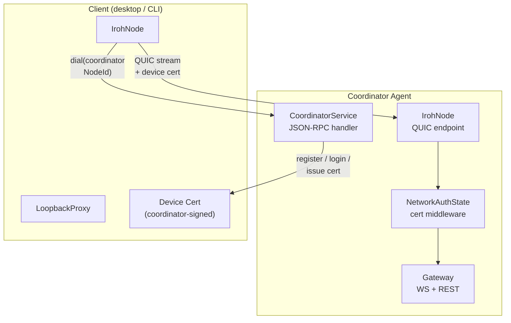
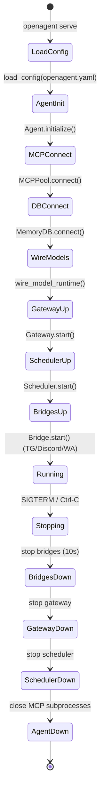
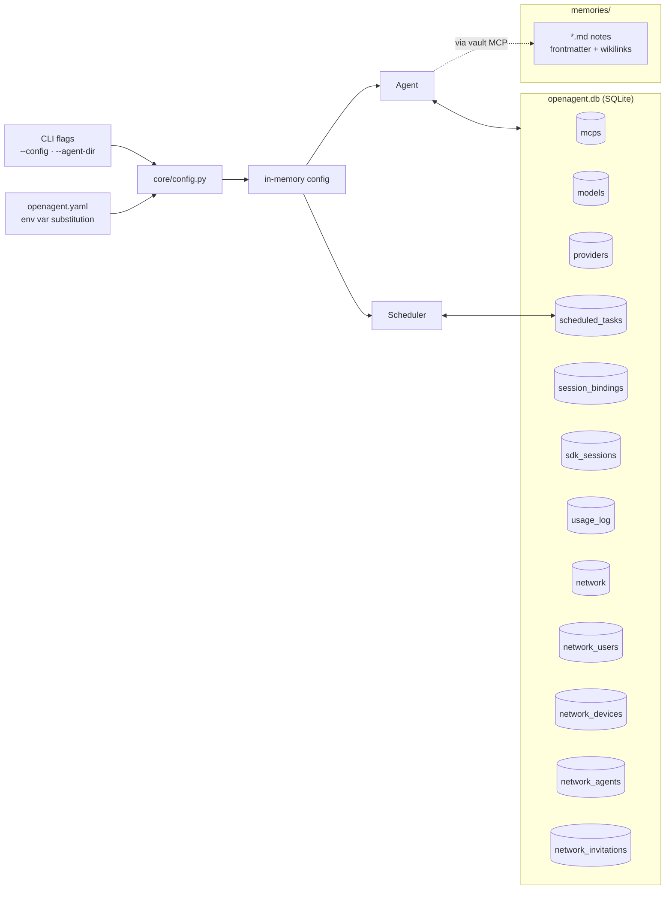

# Architecture

This page is a tour of how OpenAgent is put together — the long-lived
components, how a message moves through them, and where state lives.
Diagrams use [Mermaid](https://mermaid.js.org/): plain text, renders
automatically on GitHub and in most Markdown viewers, easy for humans and
AI assistants to edit.

The Gateway — the WebSocket + REST surface that clients connect to — is
covered in its own [Gateway](./gateway.md) page and is drawn here only as
the transport boundary. The network layer (Iroh P2P transport, coordinator,
device certificates) is covered in [Invitation System & Networking](./invitation-system.md).

## 1. Component map

Everything below runs inside a single `AgentServer` process started by
`openagent serve`. The server owns the lifecycle of the agent, MCP pool,
scheduler, and any bridges; nothing runs as a separate daemon.



Each box expands into its own section below. The later diagrams zoom in
on what SmartRouter does (§3), how the MCP pool is built (§4), how the
vault is accessed (§5), how the scheduler drives tasks and Dream Mode
(§6), how the network layer operates (§7), and where state lives (§8).
The Gateway itself has its own [dedicated page](./gateway.md).

## 2. Message flow

A chat turn arrives at the Gateway, gets queued per client, and lands in
`Agent.run()`. The agent hands generation to SmartRouter, which either
delegates to the API provider path (which runs its own tool loop against
the pool) or to Claude CLI (which spawns a subprocess with the same MCP
pool wired in).



## 3. SmartRouter: one router, two backends

OpenAgent is model-agnostic because `SmartRouter` is the only thing the
agent talks to. It owns three responsibilities on every turn:

1. **Read the enabled catalog.** Rows in the `models` table marked
   `enabled=1`, joined with `providers`, produce the set of `runtime_id`s
   the router may dispatch to. Zero enabled models → fail-fast error, no
   silent fallback.
2. **Pick a model.** If the session is already bound, reuse that binding.
   Otherwise a cheap classifier LLM picks the single best `runtime_id`
   from the enabled catalog based on the turn's content.
3. **Bind the session.** First dispatch writes `session_bindings` so
   every follow-up turn in that session stays on the same side (the API
   path's session store vs. Claude CLI's session store — mixing them
   would split the conversation). Bindings persist across restarts via
   `session_bindings` and `sdk_sessions`.



### API path

`APIProvider` is OpenAgent's runtime for hosted LLM APIs. It runs the
tool-calling loop in process, consuming the pool's pre-built `MCPTools`
toolkits and handling tool dispatch, retries, and JSON-schema plumbing
internally. Per-session history is stored in the runtime's canonical
sessions table.

### Claude CLI side

`ClaudeCLIRegistry` manages one or more claude-cli models (e.g.
`claude-cli/claude-sonnet-4-6`). On first dispatch for a session it spawns
`claude-agent-sdk` as a subprocess, passing the pool's stdio/URL specs to
`ClaudeSDKClient(mcp_servers=…)` and `--strict-mcp-config` so MCP load
failures surface immediately. Session IDs are mapped in `sdk_sessions` so
subsequent turns resume the same conversation.

### Hot reload

Edit a model or provider via the manager MCPs, REST, or the UI — the
gateway checks `updated_at` before the next turn and rebuilds the routing
table in place. Bound sessions keep their binding; new sessions can land
on the new entry.

## 4. MCP Pool: built-ins + customs, shared by both backends

`MCPPool` is the single source of truth for tools available to the agent.
Both model sides (the API path and Claude CLI) read from the same pool,
so we don't pay N times to spin up the same subprocess when the router
dispatches between tiers.



**Built-ins vs custom.** Built-in rows (`kind='default'` or `'builtin'`)
are auto-seeded on every boot from `BUILTIN_MCP_SPECS` — missing rows are
reinstated, existing ones (even disabled) are left untouched. Built-ins
cannot be removed, only disabled. Custom rows (`kind='custom'`) are full
CRUD via `mcp-manager`, `POST /api/mcps`, or the MCPs UI tab.

**Tool naming.** Tools are namespaced `<server>_<tool>`
(`filesystem_read_text_file`, `vault_write_note`,
`scheduler_create_scheduled_task`) so servers never collide.

See [MCP Tools](./mcp.md) for the built-in matrix and custom-MCP recipes.

## 5. Memory vault: markdown, not a database

Long-term memory is a plain **Obsidian-compatible markdown vault** — one
`.md` file per note, YAML frontmatter, `[[wikilinks]]`, tags. The agent
never talks to it directly; every read and write goes through the
`vault` MCP, which is just another server in the pool.



The same folder opens untouched in Obsidian — graph view, backlinks,
plugins all work. The REST endpoints under `/api/vault/*` give the
desktop app a read surface (notes list, graph, full-text search) without
going through the MCP round-trip. See [Memory & Vault](./memory.md) for
note conventions.

Only scheduled-task and bookkeeping state lives in the SQLite DB — the
vault is the knowledge store.

## 6. Scheduler and Dream Mode

The Scheduler is a 30-second tick loop that reads `scheduled_tasks` from
SQLite and invokes `agent.run(prompt)` for each task whose cron is due.
Because tasks call the regular agent entry point, they get the same
model router, MCP pool, and vault access as any user turn — a task is
just a prompt on a schedule.



**Dream Mode** is a specific built-in scheduled task that runs nightly
maintenance: consolidates duplicate memory files, cross-links notes with
wikilinks, runs a health check, writes a dream log back to the vault. It
has no dedicated daemon — it's literally a `scheduled_tasks` row with a
fixed prompt and a nightly cron, invoked through the same tick loop.

```yaml
dream_mode:
  enabled: true
  time: "3:00"   # local time
```

**Auto-update** piggybacks on the same tick (default every 6 hours):
check GitHub releases → download → on next restart the launcher picks
the new binary. See [Scheduler & Dream Mode](./scheduler.md).

## 7. Network layer: Iroh P2P transport

OpenAgent uses **Iroh** — a QUIC-based P2P networking library — instead of
plain TCP. Every agent has an Iroh identity (Ed25519 keypair) and a
NodeId derived from it. Communication is end-to-end encrypted and
authenticated, with NAT traversal via Iroh relays.

At startup, the `AgentServer` initialises its network state:



### Network roles

Every agent has a `network` role stored as a singleton row in SQLite:

| Role | Behaviour |
|---|---|
| **Standalone** | No network. No gateway. Local-only. |
| **Coordinator** | Owns the network. Runs the coordinator JSON-RPC service. Mints invites, signs device certs, manages user/device/agent registrations. |
| **Member** | Joined another coordinator's network. Connects via Iroh, presents device cert on every stream. |

### Device certificates

Instead of bearer tokens or shared secrets, every client authenticates
with a **coordinator-signed device certificate**. The cert binds
`(handle, device_pubkey, network_id)` with a 30-day TTL. It is obtained
through an SRP-6a PAKE login flow (password-authenticated key exchange)
that never transmits the plaintext password.

The `NetworkAuthState` middleware verifies every inbound request: checks
the Ed25519 signature against the pinned coordinator pubkey, verifies the
cert isn't expired, confirms it's for this network, and checks the device
hasn't been revoked. Failed auth → `401 unauthorized`.

### Auto-bootstrap

On first `openagent serve`, if no network row exists the server
auto-promotes to coordinator: generates an Iroh identity, creates a
network UUID, writes the singleton `network` row, and mints a one-shot
user invite ticket printed to the console. The user pastes this ticket
into any client to join — no separate setup command needed.

See [Invitation System & Networking](./invitation-system.md) for the full
ticket lifecycle, coordinator RPC API, and multi-agent federation.

## 8. Startup and shutdown

`AgentServer.start()` brings components up in a fixed order so the
Gateway never accepts traffic before the agent and MCP pool are ready;
shutdown runs the reverse with bounded timeouts.



## 9. State layout

Config is layered: CLI flags → `openagent.yaml` → SQLite runtime
overrides. Anything a user can toggle at runtime (MCPs, models,
providers, tasks, session bindings, usage) lives in the DB; the YAML is
for bootstrap, channel credentials, and things that rarely change.



## 10. Extensibility at a glance

Three mechanisms, all configuration-driven — no plugin framework:

- **MCP servers** add tools (`mcp-manager`, `POST /api/mcps`, or the
  MCPs UI tab). No code changes.
- **Scheduled tasks** put `agent.run(prompt)` on a cron (`scheduler`
  MCP, `/api/scheduled-tasks`).
- **Channels / bridges** are WebSocket clients of the Gateway
  (`BaseBridge` subclass, ~150 lines) — adding a new platform never
  touches the core.

## Editing these diagrams

Every diagram is a fenced ` ```mermaid ` block. Preview locally with the
VS Code Mermaid extension, or push to GitHub and view the rendered
Markdown. AI assistants can edit any block directly with an `Edit` on
this file.
