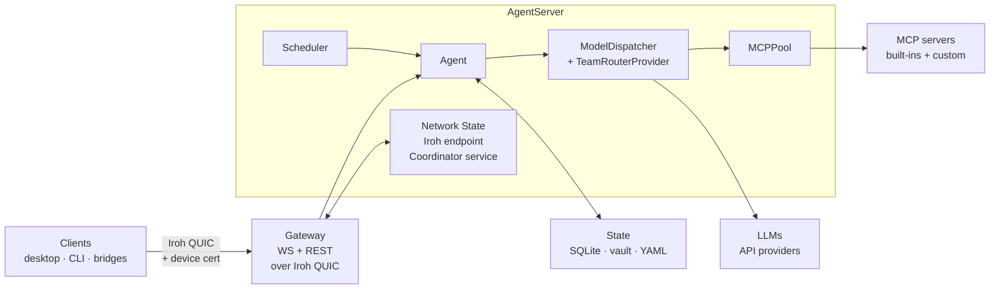
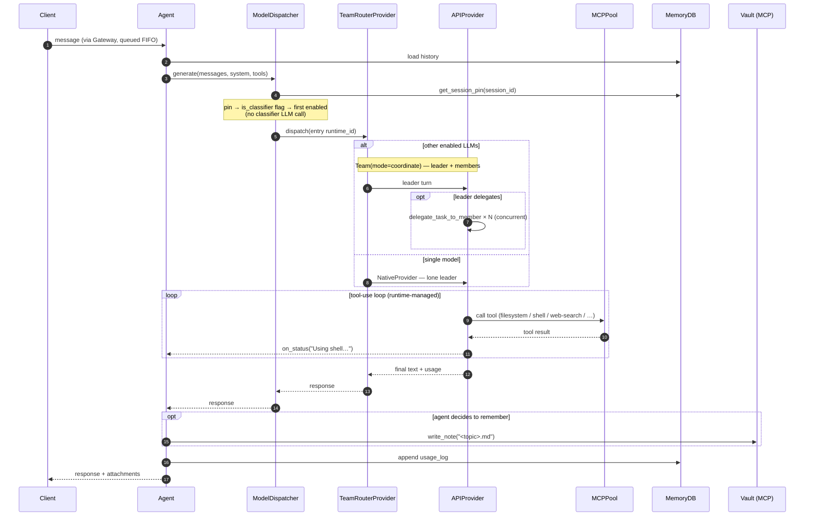
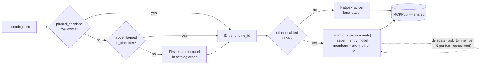
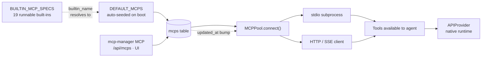
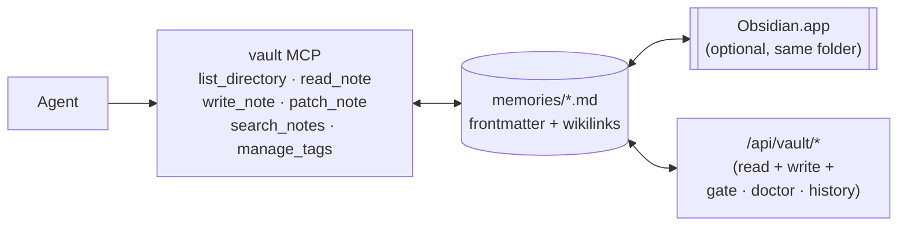
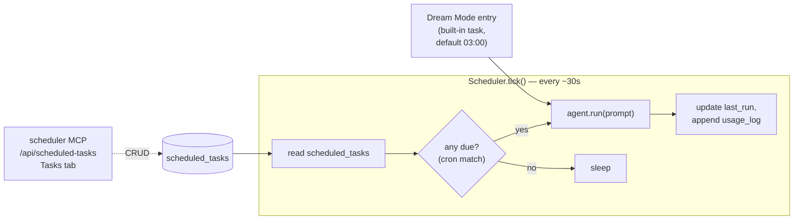
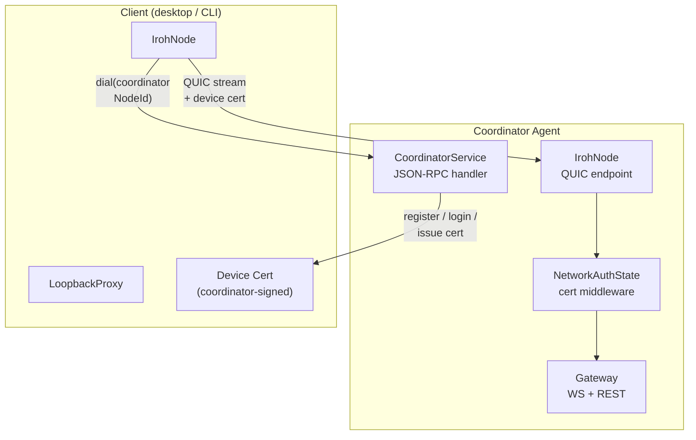
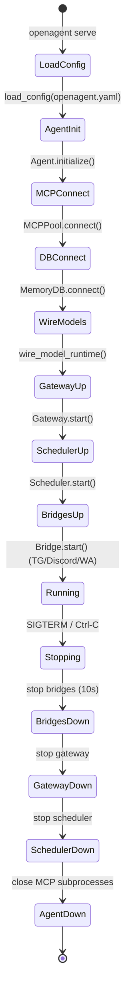
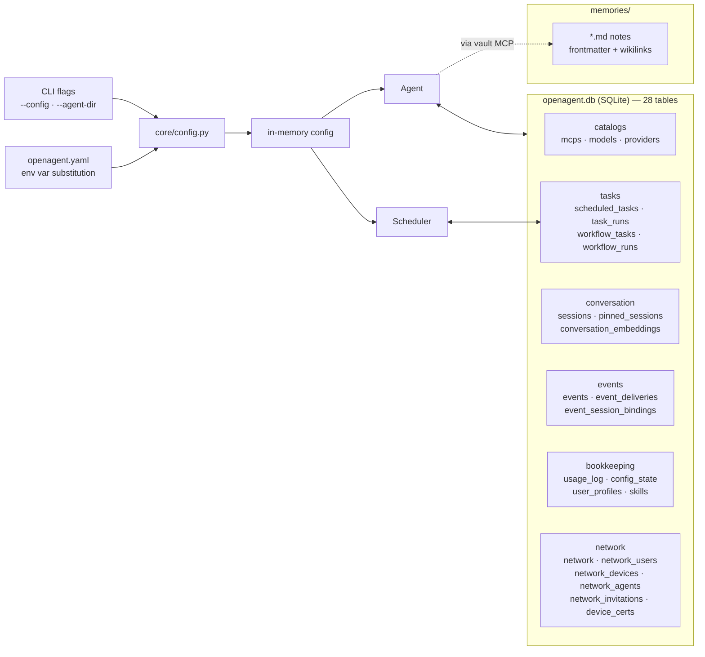

# Architecture

This page is a tour of how OpenAgent is put together — the long-lived
components, how a message moves through them, and where state lives.
Diagrams use [Mermaid](https://mermaid.js.org/): plain text, renders
automatically on GitHub and in most Markdown viewers, easy for humans and
AI assistants to edit.

The Gateway — the WebSocket + REST surface that clients connect to — is
covered in its own [Gateway](./gateway.md) page and is drawn here only as
the transport boundary. The network layer (Iroh P2P transport, coordinator,
device certificates) is covered in [Invitation System & Networking](./invitation-system.md).

## 1. Component map

Everything below runs inside a single `AgentServer` process started by
`openagent serve`. The server owns the lifecycle of the agent, MCP pool,
scheduler, and any bridges; nothing runs as a separate daemon.



Each box expands into its own section below. The later diagrams zoom in
on how a turn is routed (§3), how the MCP pool is built (§4), how the
vault is accessed (§5), how the scheduler drives tasks and Dream Mode
(§6), how the network layer operates (§7), and where state lives (§8).
The Gateway itself has its own [dedicated page](./gateway.md).

## 2. Message flow

A chat turn arrives at the Gateway, gets queued per client, and lands in
`Agent.run()`. The agent hands generation to `ModelDispatcher`, which
resolves an entry model and dispatches through `TeamRouterProvider`.
Today every model runs on the `api-based` framework, whose native runtime
runs its own tool loop against the pool.



## 3. ModelDispatcher: entry model, then a team

OpenAgent is model-agnostic because `ModelDispatcher` is the only thing
the agent talks to. Routing happens in **two layers**, and neither one is
a classifier LLM call:

1. **Resolve the entry model** (`ModelDispatcher`). Cheap, deterministic,
   no LLM involved — the dispatcher's own docstring reads *"Entry-model
   resolution (no classifier LLM call)"*. The order is: **per-session
   pin** (`pinned_sessions` table) → the model flagged `is_classifier` in
   the catalog → the **first enabled** model in catalog order. Rows in
   the `models` table marked `enabled=1`, joined with `providers`,
   produce the set of `runtime_id`s available. Zero enabled models →
   fail-fast error, no silent fallback.
2. **Route inside a team** (`TeamRouterProvider`). The entry model is not
   necessarily the model that answers. The dispatcher hands the turn to a
   `TeamRouterProvider`, which lazily builds one vendored-runtime
   `Team(mode=coordinate)` per session: the **leader** is the entry
   model, and the **members** are every *other* enabled LLM. The leader
   decides — per turn — whether to answer directly or fire one or more
   `delegate_task_to_member` calls. Multiple delegations in a single turn
   run **concurrently**.

Despite the name, `is_classifier` does not select a classifier: it is the
user's persistent *default team leader* hint, set in the model-manager
UI. It is a stored preference, not a per-turn decision.

::: warning Single-model deployments skip the team
A `Team` of one has nothing to route to. When only one LLM is enabled —
the common case — `TeamRouterProvider` skips the team build entirely and
dispatches the lone leader through a bare `NativeProvider`.
:::



### Two independent team mechanisms

`Team(mode=coordinate)` above groups members **by model**. There is a
second, unrelated team built one layer down by
`NativeProvider._ensure_team()`: a `Team(mode=route)` whose members are
grouped **by MCP tool family**, one specialist per family. It triggers
when a single model has **two or more connected MCP servers**.

The two are orthogonal, and which one backs the `<team_members>` a
leader sees depends on deployment shape:

| Enabled LLMs | Connected MCP families | What routes the turn |
|---|---|---|
| 1 | < 2 | Nothing — a single agent answers |
| 1 | ≥ 2 | `NativeProvider` tool-family team (`mode=route`) |
| ≥ 2 | any | `TeamRouterProvider` model team (`mode=coordinate`) |

### Session pinning

There is no automatic "bind the session to the first model that served
it". A session stays on a `runtime_id` only when something **explicitly
pins** it — the user asking to switch models, or the agent calling
`model_manager_pin_session` on itself. Pins live in the `pinned_sessions`
table (migrated from the older `session_bindings`) and persist across
restarts. A pin pointing at a since-disabled model is self-healing: the
dispatcher unpins it and falls through to normal resolution.

Conversation state lives in one canonical sessions store shared across
frameworks, so history never splits regardless of which member answers.

### The api-based framework

Each model row carries a `framework`. Today the only shipped value is
`api-based`, served by `APIProvider` — OpenAgent's native runtime for
hosted LLM APIs. It runs the tool-calling loop in process, consuming the
pool's pre-built `MCPTools` toolkits and handling tool dispatch, retries,
and JSON-schema plumbing internally. Per-session history is stored in the
runtime's canonical sessions table.

The `framework` column and the dispatch branch above are the seam that
keeps OpenAgent framework-agnostic: a future framework can register
behind its own `framework` value without disturbing the api-based path.

### Hot reload

Edit a model or provider via the manager MCPs, REST, or the UI — the
gateway checks `updated_at` before the next turn and rebuilds the routing
table in place. Changing `providers_config` invalidates each
`TeamRouterProvider`'s per-session cache, so the next turn rebuilds its
team with the new members and role blurbs. Pinned sessions keep their pin;
enabling a second model turns a single-agent deployment into a team on the
next turn.

## 4. MCP Pool: built-ins + customs, one shared pool

`MCPPool` is the single source of truth for tools available to the agent.
The native runtime reads from this one pool, so every model the router
dispatches to shares the same subprocesses rather than spinning up its
own copy.



**Built-ins vs custom.** `ensure_builtin_mcps` runs on every boot and
seeds a row for each entry in **`DEFAULT_MCPS`** — missing rows are
reinstated, existing ones (even disabled) are left untouched. Most
`DEFAULT_MCPS` entries carry a `builtin_name` that resolves against
`BUILTIN_MCP_SPECS` (the 19 servers OpenAgent knows how to run); the rest
are bare subprocess entries with their own `command`. The two sets are not
identical: `media-gen` and `memory-search` are built-in but not seeded on,
while `filesystem` is seeded on but is not a built-in. Built-in rows
(`kind='default'` or `'builtin'`) cannot be removed, only disabled. Custom
rows (`kind='custom'`) are full CRUD via `mcp-manager`, `POST /api/mcps`,
or the MCPs UI tab.

**Tool naming.** Tools are namespaced `<server>_<tool>`
(`filesystem_read_text_file`, `vault_write_note`,
`scheduler_create_scheduled_task`) so servers never collide.

See [MCP Tools](./mcp.md) for the built-in matrix and custom-MCP recipes.

## 5. Memory vault: markdown, not a database

Long-term memory is a plain **Obsidian-compatible markdown vault** — one
`.md` file per note, YAML frontmatter, `[[wikilinks]]`, tags. The agent
never talks to it directly; every read and write goes through the
`vault` MCP, which is just another server in the pool.



The same folder opens untouched in Obsidian — graph view, backlinks,
plugins all work. The REST endpoints under `/api/vault/*` give the
desktop app the full surface — notes list, graph, full-text search, and
the maintenance operations: read/write notes (validated + committed),
run the quality gate, run the doctor, move/rename with link rewriting,
regenerate derived artifacts, and read git history with provenance.
See [Memory & Vault](./memory.md) for note conventions.

On top of the markdown sits a code-enforced quality system — an
incremental SQLite + FTS5 index, a quality gate, a mechanical doctor, a
git-backed history, and dream-mode maintenance. The index is a cache;
the markdown remains the source of truth. See
[Vault Quality System](./vault-quality.md) for the full picture.

The split is about *knowledge*, not about volume: the vault is the
knowledge store, while the SQLite DB holds operational state — sessions
and transcripts, the MCP / model / provider catalogs, scheduled tasks,
workflows, events, network identity, and usage. See §9 for the layout.

## 6. Scheduler and Dream Mode

The Scheduler is a 30-second tick loop that reads `scheduled_tasks` from
SQLite and invokes `agent.run(prompt)` for each task whose cron is due.
Because tasks call the regular agent entry point, they get the same
model router, MCP pool, and vault access as any user turn — a task is
just a prompt on a schedule.



**Dream Mode** is a specific built-in scheduled task that runs nightly
maintenance across two missions: curate the vault (merge duplicates,
cross-link with wikilinks, reconcile contradictions), then read the last
~24h of `events.jsonl` and repair what broke — errored scheduled tasks,
failed workflows, recurring model / MCP / channel errors — writing a dream
log back to the vault under `dream-logs/`. It has no dedicated daemon —
it's literally a `scheduled_tasks` row with a fixed prompt and a nightly
cron, invoked through the same tick loop.

```yaml
dream_mode:
  enabled: true
  time: "3:00"   # local time
```

**Auto-update** is the other built-in task and piggybacks on the same
tick: check GitHub releases → download → on next restart the launcher
picks the new binary. It is **off unless you enable it**; once enabled it
defaults to a daily `0 4 * * *` check, overridable via
`auto_update.check_interval`. See [Scheduler & Dream Mode](./scheduler.md).

## 7. Network layer: Iroh P2P transport

OpenAgent uses **Iroh** — a QUIC-based P2P networking library — instead of
plain TCP. Every agent has an Iroh identity (Ed25519 keypair) and a
NodeId derived from it. Communication is end-to-end encrypted and
authenticated, with NAT traversal via Iroh relays.

At startup, the `AgentServer` initialises its network state:



### Network roles

Every agent has a `network` role stored as a singleton row in SQLite:

| Role | Behaviour |
|---|---|
| **Standalone** | No network. No gateway. Local-only. |
| **Coordinator** | Owns the network. Runs the coordinator JSON-RPC service. Mints invites, signs device certs, manages user/device/agent registrations. |
| **Member** | Joined another coordinator's network. Connects via Iroh, presents device cert on every stream. |

### Device certificates

Instead of bearer tokens or shared secrets, every client authenticates
with a **coordinator-signed device certificate**. The cert binds
`(handle, device_pubkey, network_id)` with a 30-day TTL. It is obtained
through an SRP-6a PAKE login flow (password-authenticated key exchange)
that never transmits the plaintext password.

The `NetworkAuthState` middleware verifies every inbound request: checks
the Ed25519 signature against the pinned coordinator pubkey, verifies the
cert isn't expired, confirms it's for this network, and checks the device
hasn't been revoked. Failed auth → `401 unauthorized`.

### Auto-bootstrap

On first `openagent serve`, if no network row exists the server
auto-promotes to coordinator: generates an Iroh identity, creates a
network UUID, writes the singleton `network` row, and mints a one-shot
user invite ticket printed to the console. The user pastes this ticket
into any client to join — no separate setup command needed.

See [Invitation System & Networking](./invitation-system.md) for the full
ticket lifecycle, coordinator RPC API, and multi-agent federation.

## 8. Startup and shutdown

`AgentServer.start()` brings components up in a fixed order so the
Gateway never accepts traffic before the agent and MCP pool are ready;
shutdown runs the reverse with bounded timeouts.



## 9. State layout

Config is layered: CLI flags → `openagent.yaml` → SQLite runtime
overrides. Anything a user can toggle at runtime (MCPs, models,
providers, tasks, session pins, usage) lives in the DB; the YAML is
for bootstrap, channel credentials, and things that rarely change.



## 10. Extensibility at a glance

Three mechanisms, all configuration-driven — no plugin framework:

- **MCP servers** add tools (`mcp-manager`, `POST /api/mcps`, or the
  MCPs UI tab). No code changes.
- **Scheduled tasks** put `agent.run(prompt)` on a cron (`scheduler`
  MCP, `/api/scheduled-tasks`).
- **Channels / bridges** are WebSocket clients of the Gateway
  (`BaseBridge` subclass, ~150 lines) — adding a new platform never
  touches the core.

## Editing these diagrams

Every diagram is a fenced ` ```mermaid ` block. Preview locally with the
VS Code Mermaid extension, or push to GitHub and view the rendered
Markdown. AI assistants can edit any block directly with an `Edit` on
this file.
