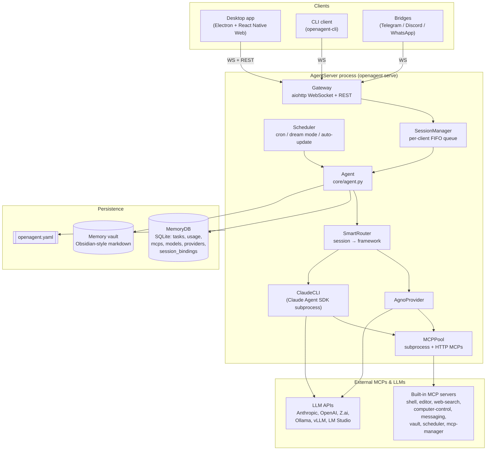
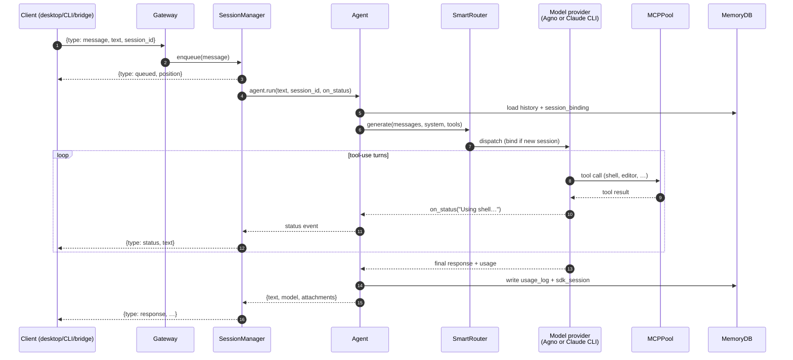
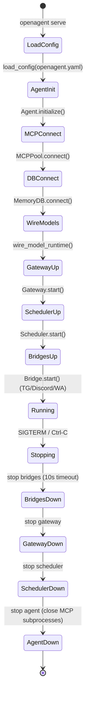
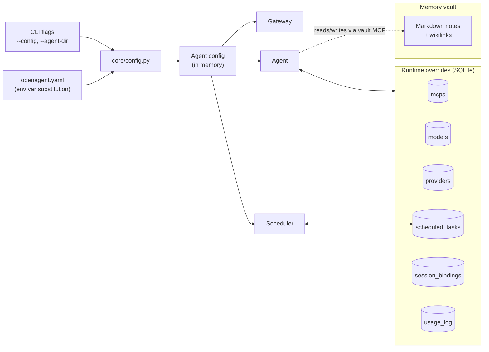

# Architecture

This document describes how OpenAgent is designed and how data flows through
the system. Diagrams use [Mermaid](https://mermaid.js.org/) — a plain-text
diagram format that renders automatically on GitHub, in most Markdown
viewers, and in VS Code, while staying easy for both humans and AI
assistants to read and edit.

## 1. Component overview

The runtime is a single `AgentServer` process that owns the agent, the
gateway, the MCP pool, the scheduler, and any channel bridges. All clients
(desktop app, CLI, Telegram/Discord/WhatsApp bridges) talk to the same
gateway.



## 2. Message flow (chat request)

What happens when a user sends a message over the WebSocket gateway.



## 3. Startup & shutdown lifecycle

`AgentServer.start()` brings components up in a fixed order so the gateway
never accepts traffic before the agent and MCP pool are ready. Shutdown
runs the reverse.



## 4. Configuration & persistence

Config is layered: CLI flags → `openagent.yaml` → SQLite runtime DB. The DB
wins for anything a user can toggle at runtime (MCPs, models, providers,
tasks, session bindings). The memory vault is separate — it is long-term
knowledge exposed through the `vault` MCP, not a DB table.



## 5. Extensibility model

OpenAgent has no traditional plugin system. Extensibility comes from three
mechanisms, all configuration-only:

- **MCP servers** — add a `command:` or `url:` entry under `mcp:` in
  `openagent.yaml` (or via the `mcp-manager` MCP at runtime) to expose new
  tools. No Python code changes needed.
- **Scheduled tasks** — cron entries that invoke `agent.run(prompt)` on a
  schedule; dream mode is the built-in nightly maintenance task.
- **Channel bridges** — each bridge (Telegram, Discord, WhatsApp) is a
  WebSocket client of the same gateway, so adding a new channel means
  writing a bridge, not modifying the core.

## Editing these diagrams

Each diagram is a fenced ` ```mermaid ` block. To preview locally, open this
file in VS Code with the Mermaid preview extension, or push to GitHub and
view the rendered Markdown. AI assistants can edit the diagrams as plain
text using `Edit` on this file.
