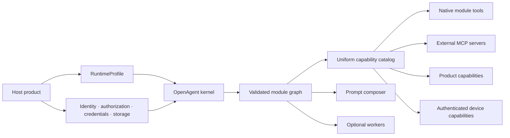

# Architecture

OpenAgent v1.1 separates the reusable runtime from the complete standalone
product. GlassPalace, Replio and other products import the same public Core
packages and select their own modules, identity adapters and capability
sources.

## Repositories

| Repository | Responsibility |
| --- | --- |
| [`openagent-core`](https://github.com/openagent-uno/openagent-core) | Kernel, contracts, SDK, SQLite storage, gateway and optional module wheels |
| [`openagent-tools`](https://github.com/openagent-uno/openagent-tools) | Standalone filesystem, editor, shell, web-search and device tools |
| [`openagent`](https://github.com/openagent-uno/openagent) | Standalone app, CLI, server, MCP bridge, identity, dashboards and distribution |

The dependency direction is one-way: the product consumes Core and Tools;
Core never imports product code or concrete computer tools. A product such as
GlassPalace pins Core packages in its own worker build and owns its own pods,
sandbox, volumes, credentials and rollout.

## Kernel, modules, surfaces and resources

The architecture uses four terms consistently:

1. **Kernel** — lifecycle, identity context, authorization, runs, events,
   idempotency, session substrate, capability dispatch, prompt composition and
   module resolution.
2. **Module** — an optional, versioned domain with its own services, storage,
   migrations and lifecycle.
3. **Surface** — how a module is exposed: `service`, `agent_tools`, `host_api`,
   `workers` or `event_ingress`.
4. **Resource** — an object managed by a module, such as an MCP server,
   workflow, schedule, event or vault note.

The kernel creates no user, listener, MCP, model or background worker as a side
effect of construction. A session store is required for every run, while
session search and administration are provided by the optional Sessions
module.


```mermaid
flowchart LR
    Host[Host product] --> Profile[RuntimeProfile]
    Host --> Services[Identity · authorization · credentials · storage]
    Profile --> Runtime[OpenAgent kernel]
    Services --> Runtime
    Runtime --> Graph[Validated module graph]
    Graph --> Catalog[Uniform capability catalog]
    Graph --> Prompt[Prompt composer]
    Graph --> Workers[Optional workers]
    Catalog --> Native[Native module tools]
    Catalog --> MCP[External MCP servers]
    Catalog --> Product[Product capabilities]
    Catalog --> Device[Authenticated device capabilities]
```

## Uniform module contract

Each module package exports a descriptor and an instance lifecycle. A
descriptor declares dependencies, required and provided services, supported
surfaces, migrations and validation. Starting an instance returns typed
services, capability sources, prompt blocks, gateway commands, workers, health
checks and rebuildable indexes.

The same profile mechanism configures every product:

```python
profile = RuntimeProfile(
    generation=12,
    modules={
        "sessions": ModuleConfig(
            surfaces={"service", "agent_tools", "host_api"},
        ),
        "mcp": ModuleConfig(
            surfaces={"service", "host_api"},
            options={"catalog_mode": "managed"},
        ),
        "scheduler": ModuleConfig(
            surfaces={"service", "agent_tools", "workers"},
        ),
    },
)

runtime = Runtime(settings=settings, services=services, profile=profile)
await runtime.start()
```

The host selects the graph. The authorizer then filters individual operations
and resources for every turn. The agent cannot install or enable modules.

## Optional modules

Core publishes separate wheels for Sessions, Search, Vault, MCP, Workflows,
Scheduler, Events, Delegation, Skills, Models, Budget, Attachments, Logs, PTC
and Tool Discovery. `openagent-modules-full` is only a convenience
meta-package.

Workflows, Scheduler and Events are independent. A schedule can start a run
without Workflows; Events can target a run without either module. Integrations
appear only when both participating modules are active.

Vault and Sessions are also independent:

- Sessions owns transcript listing, reading, search, creation, rename,
  archive, restore and explicitly authorized purge.
- Vault owns consolidated notes, recall, writes, quality checks, reminders,
  provenance and dream maintenance.
- Search can federate providers from whichever modules are active.

Removing a module removes its tools, routes, workers and prompt instructions.
Its stored data remains available for later reactivation unless an explicit
administrative purge is performed.

## Capabilities and MCP

Every callable capability is discovered through one catalog and invoked by an
opaque `ToolRef`. The model does not choose a source, user or computer through
arguments. Native module tools, external MCP tools, product tools and connected
device tools all use this contract.

MCP refers only to external Model Context Protocol servers. The MCP module can
run in three modes:

- `fixed`: sources are declared by the product and cannot be changed;
- `managed`: the product changes the catalog through the host API;
- `dynamic`: an authorized agent also receives MCP management tools.

OpenAgent App and CLI register dashboards, shell, filesystem, editor,
computer-control and agent-in-chrome for the authenticated client context.
Channel turns and delayed automation do not inherit those temporary device
capabilities.

## Identity and multiuser sessions

Core receives verified abstract principals containing authority, tenant,
subject and kind. The host authenticates input and supplies the execution
context; untrusted client JSON cannot select another principal.

Every message keeps its immutable author. A run separately records its
initiator, active delegation, capability origins and result audience. Messages
from another participant create a separately authorized turn and do not reuse
the preceding author's credentials. Child sessions keep the authorized
delegation of their parent turn while retaining agent authorship.

## Prompt composition

Every agent run composes, in order:

1. mandatory kernel rules;
2. mandatory rules from active module surfaces;
3. the host's configurable system prompt and persona;
4. verified turn context and the current capability snapshot.

Tool Discovery carries the rules for discovery, exact references, canonical
tools, structured operations, long-running work and result verification. Vault
carries recall, successful-save, deduplication, quality, citation and end-of-turn
rules. The standalone full profile enables both, preserving the established
tool and memory discipline. A host system prompt cannot replace these blocks.

Each run records profile generation, module versions, enabled surfaces, prompt
hashes and capability-catalog generation. Revocation and destination
availability are still checked at every tool call.

## Hot reconfiguration

Installed, verified modules can be activated, disabled or reconfigured without
restarting the process. The runtime validates the proposed graph, prepares new
instances in shadow, swaps the generation atomically, admits new runs on the new
graph and drains old runs before closing the previous instances. Failure before
the swap leaves the old graph active.

Installing or upgrading package files still requires a new build or process.
`mode="force"` explicitly cancels runs bound to removed modules; no data is
silently deleted.

## Product profiles

- **OpenAgent standalone** enables the full module set, dynamic MCP management
  and configurable PTC, then accepts temporary App or CLI capabilities.
- **GlassPalace** uses federated Sessions, Vault and automation modules, a
  product-managed MCP catalog, GlassPalace connectors and authorized Computers.
- **Replio reference** uses Sessions and fixed native capabilities without
  dynamic MCP, Vault or automation unless its host opts in.

This makes `kernel + Sessions`, `Sessions + Vault`, Scheduler without
Workflows, MCP without an agent manager, native tools without MCP and the full
standalone product ordinary configurations of the same runtime.
